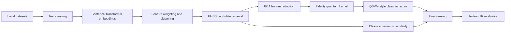

# Quantum-Assisted Semantic Information Retrieval for Ranking and Evaluation

[](https://www.python.org/)
[](https://www.sbert.net/)
[](https://www.ibm.com/quantum/qiskit)
[](https://github.com/facebookresearch/faiss)
[](tests/)
[](LICENSE)

This project retrieves and ranks documents from the 20 Newsgroups and
Reuters-21578 datasets. It uses Sentence Transformer embeddings and FAISS for
candidate retrieval, then uses a fidelity quantum kernel and QSVM scores for
final ranking. Quantum computation runs locally with statevector simulation.

## Project Scope

- Task: Semantic document retrieval and ranking
- Input: 20 Newsgroups documents and Reuters-21578 SGML articles
- Processing: Text cleaning, semantic embeddings, clustering, candidate search,
  quantum-kernel scoring, and QSVM scoring
- Output: Ranked documents and held-out retrieval metrics
- Evaluation: Precision@5, Precision@10, MAP@10, and NDCG@10

## Architecture



## Features

- Load 20 Newsgroups and Reuters-21578 documents.
- Create semantic embeddings with `all-MiniLM-L6-v2`.
- Cluster document embeddings and retrieve candidates with FAISS.
- Generate fidelity quantum kernels with `ZZFeatureMap` and local statevector
  simulation.
- Train a precomputed-kernel SVM; Reuters uses multi-label topic scoring.
- Combine 10% classical similarity, 50% quantum-kernel similarity, and 40%
  QSVM decision score for final ranking.
- Evaluate held-out documents and display metric graphs.

## Technology Stack

| Area | Technology |
| --- | --- |
| Programming language | Python 3.11 |
| Semantic embeddings | Sentence Transformers (`all-MiniLM-L6-v2`) |
| Classical retrieval | FAISS, scikit-learn, NumPy |
| Quantum machine learning | Qiskit and Qiskit Machine Learning |
| Quantum simulation | `FidelityStatevectorKernel` with `ZZFeatureMap` |
| Classification | Precomputed-kernel SVC and one-vs-rest SVC |
| Data processing | Beautiful Soup, NumPy |
| Evaluation and graphs | Custom IR metrics, Matplotlib, Seaborn |
| Testing | Python `unittest` |

## Repository Structure

```text
quantum-assisted-semantic-information-retrieval-for-ranking-and-evaluation/
|-- data/
|   |-- 20_newsgroups/     # Newsgroups category folders and documents
|   `-- reuters21578/      # Reuters SGML source files
|-- tests/                 # Automated regression and smoke tests
|-- app.py                 # Application state, training, ranking, and CLI
|-- config.py              # Paths, versions, and ranking weights
|-- data.py                # Dataset loading and train/evaluation splitting
|-- embeddings.py          # Embedding model loading and cache validation
|-- main.py                # Application launcher
|-- metrics.py             # IR metrics and evaluation-query construction
|-- plotting.py            # Safe plot display helper
|-- quantum.py             # Quantum kernel and retrieval support utilities
|-- text.py                # Text normalization and output formatting
|-- .gitignore             # Ignored generated and local files
|-- LICENSE                # MIT License
|-- README.md              # Project documentation
`-- requirements.txt       # Pinned Python dependencies
```

## Installation and Run

Python 3.11 is required.

From the project folder, create a virtual environment and install dependencies:

```powershell
python -m venv .venv
.venv\Scripts\python -m pip install --upgrade pip
.venv\Scripts\python -m pip install -r requirements.txt
```

Ensure the datasets have this layout before training:

```text
data/
|-- 20_newsgroups/
|   |-- alt.atheism/
|   `-- ...
`-- reuters21578/
    |-- reut2-000.sgm
    `-- ...
```

Start the application:

```powershell
.venv\Scripts\python main.py
```

Use the menu to train a dataset model, load a saved model, search documents,
evaluate held-out queries, and display graphs. The first training run downloads
the `all-MiniLM-L6-v2` model unless it is already cached locally.

## Evaluation and Results

Evaluation uses relevance judgements known before retrieval:

- 20 Newsgroups: documents in the same category are relevant.
- Reuters-21578: documents with overlapping topics are relevant.

Run menu option 5 after training to calculate Precision@5, Precision@10,
MAP@10, and NDCG@10. Run menu option 6 to display the resulting graphs.

Results are printed after evaluation. No fixed benchmark values are included
because they depend on the selected dataset and local execution environment.

## Limitations

- This is a hybrid system, not a fully quantum implementation.
- Quantum kernels run with local statevector simulation rather than quantum
  hardware.
- PCA reduces inputs to at most four features because statevector simulation
  becomes expensive as the number of encoded features grows.
- Candidate retrieval improves speed but may exclude relevant documents before
  the quantum re-ranking stage.
- QSVM training uses a deterministic subset of the training set to limit kernel
  computation cost.

## Author

Guna Rithvick

## License

This project is licensed under the [MIT License](LICENSE).

## Tests

Run the automated tests with:

```powershell
python -m unittest discover -s tests -v
```
