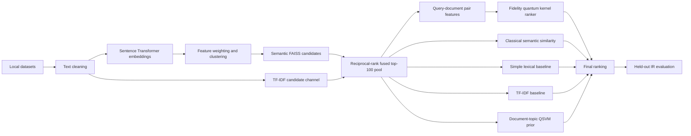

# Quantum-Assisted Semantic Information Retrieval For Ranking And Evaluation

[](https://www.python.org/)
[](https://www.sbert.net/)
[](https://www.ibm.com/quantum/qiskit)
[](https://github.com/facebookresearch/faiss)
[](tests/)
[](LICENSE)

This project retrieves and ranks documents from 20 Newsgroups and
Reuters-21578, Distribution 1.0. The raw datasets are not included in the
repository; download them separately and place them in the required `data/`
directories using the Dataset Setup section below. The project uses Sentence
Transformer embeddings and FAISS for semantic and TF-IDF candidate retrieval
fused into a shared 100-document pool, then uses a query-document fidelity
quantum kernel and QSVM scores for final ranking. Quantum computation runs
locally with statevector simulation.

## Project Scope

- Task: Semantic document retrieval and ranking
- Input: 20 Newsgroups documents and Reuters-21578, Distribution 1.0 SGML articles
- Processing: Text cleaning, semantic embeddings, clustering, candidate search,
  quantum-kernel scoring, and QSVM scoring
- Output: Ranked documents and held-out retrieval metrics
- Evaluation: Precision@5, Precision@10, MAP@10, NDCG@10, and Candidate
  Recall@100 with fixed-seed variation checks

## Architecture



## Features

- Load 20 Newsgroups and Reuters-21578, Distribution 1.0 documents.
- Create semantic embeddings with `all-MiniLM-L6-v2`.
- Cluster document embeddings for analysis and retrieve global candidates with
  FAISS; hard cluster exclusion is disabled to protect candidate recall.
- Merge semantic and TF-IDF candidate channels with reciprocal-rank fusion.
- Generate fidelity quantum kernels with `ZZFeatureMap` and local statevector
  simulation.
- Train a query-document pairwise precomputed-kernel SVM for relevance.
- Train a document-topic QSVM prior; Reuters uses multi-label topic scoring.
- Compare simple lexical, TF-IDF, classical semantic, and quantum-assisted
  ranking on the same held-out queries.
- Score the same semantic-and-TF-IDF reciprocal-rank-fused top-100 candidate
  pool for every ranking method.
- Tune the quantum-assisted fusion weights on a validation split, then refit
  the final pipeline on all training documents.
- Evaluate held-out documents and display comparison graphs.

## Technology Stack

| Area | Technology |
| --- | --- |
| Programming language | Python 3.11 |
| Semantic embeddings | Sentence Transformers (`all-MiniLM-L6-v2`) |
| Classical retrieval | FAISS, scikit-learn, NumPy |
| Quantum machine learning | Qiskit and Qiskit Machine Learning |
| Quantum simulation | `FidelityStatevectorKernel` with `ZZFeatureMap` |
| Classification and ranking | Pairwise precomputed-kernel SVC and one-vs-rest SVC |
| Data processing | Beautiful Soup, NumPy |
| Evaluation and graphs | Custom IR metrics, Matplotlib, Seaborn |
| Testing | Python `unittest` |

## Repository Structure

```text
quantum-assisted-semantic-information-retrieval-for-ranking-and-evaluation/
|-- data/                  # Local datasets; not included in repository
|   |-- 20_newsgroups/     # Locally extracted Newsgroups category folders
|   `-- reuters21578/      # Locally extracted Reuters SGML source files
|-- models/                # Generated artifacts; not included in repository
|-- tests/                 # Automated regression and smoke tests
|-- screenshots/           # Training, search, metrics, and evaluation graph screenshots
|-- app.py                 # Application state, training, ranking, and CLI
|-- config.py              # Paths, versions, and ranking weights
|-- data.py                # Dataset loading and train/evaluation splitting
|-- embeddings.py          # Embedding model loading and cache validation
|-- main.py                # Application launcher
|-- metrics.py             # IR metrics and evaluation-query construction
|-- plotting.py            # Safe plot display helper
|-- quantum.py             # Quantum kernel and retrieval support utilities
|-- text.py                # Text normalization and output formatting
|-- .gitignore             # Ignored generated and local files
|-- LICENSE                # MIT License
|-- README.md              # Project documentation
`-- requirements.txt       # Pinned Python dependencies
```

## Installation and Run

Python 3.11 is required.

From the project folder, create a virtual environment and install dependencies:

```powershell
python -m venv .venv
.venv\Scripts\python -m pip install --upgrade pip
.venv\Scripts\python -m pip install -r requirements.txt
```

The raw datasets are not included in this repository. Download and extract
them separately according to the Dataset Setup section below. The application
creates `models/` automatically for generated embeddings and trained model
files:

```text
data/
|-- 20_newsgroups/
|   |-- alt.atheism/
|   `-- ...
`-- reuters21578/
    |-- reut2-000.sgm
    `-- ...
```

Start the application:

```powershell
.venv\Scripts\python main.py
```

Use the menu to train a dataset model, load a saved model, search documents,
evaluate held-out queries, and display graphs. The first training run downloads
the `all-MiniLM-L6-v2` model unless it is already cached locally.

## Dataset Setup

The raw datasets are not included in this repository. Download them separately
and place the extracted files in the directories described below.

### 20 Newsgroups

Download the original 20 Newsgroups dataset from the
[UCI 20 Newsgroups archive](https://kdd.ics.uci.edu/databases/20newsgroups/20newsgroups.html)
or the [CMU 20 Newsgroups archive](https://www.cs.cmu.edu/afs/cs.cmu.edu/project/theo-20/www/data/news20.html).

Extract the dataset and place the category folders directly in:

```text
data/20_newsgroups/
|-- alt.atheism/
|-- comp.graphics/
|-- comp.os.ms-windows.misc/
|-- ...
`-- talk.religion.misc/
```

Each category directory must contain its document files. The loader uses the
category directory name as the document label. If the download contains
separate training and test roots, combine the category files under the single
`data/20_newsgroups/` directory before running the application; the project
creates its own deterministic leakage-free split.

### Reuters-21578, Distribution 1.0

Download `reuters21578.tar.gz` from the
[UCI Reuters-21578 dataset page](https://archive.ics.uci.edu/dataset/137/reuters+21578+text+categorization+collection).
This project expects the original SGML files from Reuters-21578, Distribution
1.0, including the `lewissplit` attributes used for the training and test
partitions.

Extract all `.sgm` files into:

```text
data/reuters21578/
|-- reut2-000.sgm
|-- reut2-001.sgm
|-- ...
`-- reut2-021.sgm
```

The accompanying metadata files may remain in the same directory. The loader
reads the SGML files, extracts article text and topics, removes empty and exact
duplicate records, and removes any exact text overlap between training and
evaluation data.

## Tests

Run the automated tests with:

```powershell
python -m unittest discover -s tests -v
```

## Evaluation and Results

Evaluation uses relevance judgements known before retrieval:

- 20 Newsgroups: documents in the same category are relevant.
- Reuters-21578, Distribution 1.0: documents with overlapping topics are relevant.

Run menu option 5 after training to compare:

- Simple lexical baseline: cleaned-token overlap over the shared candidate
  pool.
- TF-IDF baseline: TF-IDF cosine similarity over the shared candidate pool.
- Classical semantic: cosine similarity over the shared candidate pool.
- Quantum-assisted: query-document fidelity-kernel relevance score, classical
  similarity, and document-topic QSVM decision score.

Each method is evaluated with Precision@5, Precision@10, MAP@10, and NDCG@10.
MAP@10 uses truncated average precision with a denominator of
`min(relevant_documents, 10)`. NDCG@10 uses binary relevance and an ideal DCG
normalizer. Candidate Recall@100 measures how much of the known relevant set
reaches the shared semantic-and-TF-IDF candidate pool before re-ranking.

All four methods use the same shared semantic-and-TF-IDF top-100 candidate pool
before ranking.

### 20 Newsgroups Evaluation Run

The current 40-query held-out run produced Candidate Recall@100 of `0.0362`:

| Ranking method | Precision@5 | Precision@10 | MAP@10 | NDCG@10 |
| --- | ---: | ---: | ---: | ---: |
| Simple lexical baseline | 0.5900 | 0.4975 | 0.4192 | 0.5446 |
| TF-IDF baseline | 0.4750 | 0.4300 | 0.3356 | 0.4675 |
| Classical semantic | 0.4200 | 0.3925 | 0.3222 | 0.4162 |
| Quantum-assisted | 0.3900 | 0.3850 | 0.2927 | 0.3940 |

The validation split selected weights of 0.5 classical, 0.5 pairwise quantum,
and 0.0 QSVM. The quantum-assisted ranker remains below the classical semantic
baseline on this dataset.

With one held-out query per category and fixed seeds `42`, `43`, and `44`, the
Newsgroups multi-seed summary was:

| Ranking method | Precision@10 mean +/- std | MAP@10 mean +/- std | NDCG@10 mean +/- std | Recall@100 mean |
| --- | ---: | ---: | ---: | ---: |
| Simple lexical baseline | 0.5217 +/- 0.0517 | 0.4501 +/- 0.0623 | 0.5640 +/- 0.0472 | 0.0367 |
| TF-IDF baseline | 0.4450 +/- 0.0696 | 0.3790 +/- 0.0588 | 0.4928 +/- 0.0515 | 0.0367 |
| Classical semantic | 0.3967 +/- 0.0551 | 0.3270 +/- 0.0652 | 0.4124 +/- 0.0611 | 0.0367 |
| Quantum-assisted | 0.3533 +/- 0.0533 | 0.2771 +/- 0.0728 | 0.3617 +/- 0.0536 | 0.0367 |

### Reuters-21578 Evaluation Run

The current 73-query held-out run produced Candidate Recall@100 of `0.3550`:

| Ranking method | Precision@5 | Precision@10 | MAP@10 | NDCG@10 |
| --- | ---: | ---: | ---: | ---: |
| Simple lexical baseline | 0.4658 | 0.4110 | 0.3554 | 0.4519 |
| TF-IDF baseline | 0.4384 | 0.3863 | 0.3252 | 0.4223 |
| Classical semantic | 0.5096 | 0.4795 | 0.4273 | 0.5223 |
| Quantum-assisted | 0.5068 | 0.4575 | 0.4075 | 0.5033 |

Reuters validation selected weights of 0.5 classical, 0.5 pairwise quantum,
and 0.0 QSVM. The quantum-assisted ranker is close to, but below, the
classical semantic baseline on this run.

### Reuters Multi-Seed Summary

With one held-out query per eligible topic selection and fixed seeds `42`,
`43`, and `44`, the Reuters results were:

| Ranking method | Precision@10 mean +/- std | MAP@10 mean +/- std | NDCG@10 mean +/- std | Recall@100 mean |
| --- | ---: | ---: | ---: | ---: |
| Simple lexical baseline | 0.4046 +/- 0.0163 | 0.3511 +/- 0.0149 | 0.4489 +/- 0.0191 | 0.3447 |
| TF-IDF baseline | 0.3913 +/- 0.0045 | 0.3391 +/- 0.0105 | 0.4328 +/- 0.0093 | 0.3447 |
| Classical semantic | 0.4680 +/- 0.0101 | 0.4172 +/- 0.0105 | 0.5117 +/- 0.0101 | 0.3447 |
| Quantum-assisted | 0.4466 +/- 0.0078 | 0.3929 +/- 0.0109 | 0.4891 +/- 0.0101 | 0.3447 |

Use menu option 7 to repeat the fixed-seed evaluation. The in-memory query
and quantum-score caches reuse repeated queries during a session, and
`PAIRWISE_TRAINING_LIMIT` in `config.py` controls the simulator training
budget.

The feature-weighting step is an unsupervised training-only heuristic: each
embedding dimension is weighted by its variance divided by the mean variance.
This keeps the average weight near one while emphasizing higher-variance
dimensions.

Run menu option 6 to display the comparison graphs.

Results are printed after evaluation. No fixed benchmark values are included
because they depend on the selected dataset and local execution environment.

## Limitations

- This is a hybrid system, not a fully quantum implementation.
- Quantum kernels run with local statevector simulation rather than quantum
  hardware.
- PCA reduces inputs to at most four features because statevector simulation
  becomes expensive as the number of encoded features grows.
- Candidate retrieval improves speed but may exclude relevant documents before
  the quantum re-ranking stage; candidate recall should be monitored for new
  datasets.
- Pairwise quantum training uses a deterministic 400-pair sample of
  query-document examples to keep statevector-kernel simulation practical.
- QSVM training uses a deterministic subset of the training set to limit kernel
  computation cost.

## Author

Guna Rithvick

## License

This project is licensed under the MIT License.
